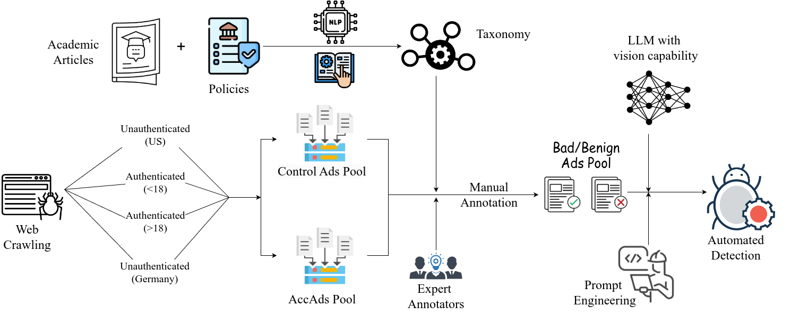
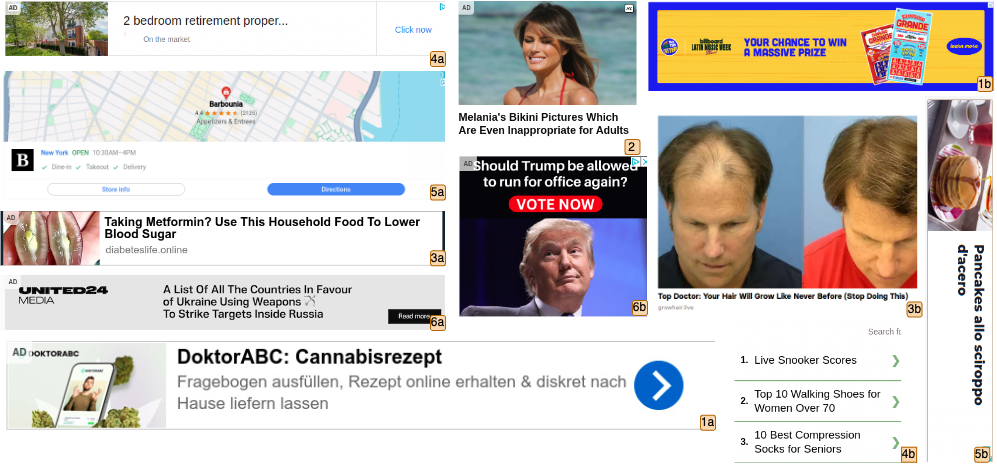

# [Sheep's clothing, wolfish impact](https://racro.github.io/papers/Accads_PETS.pdf)

This repository contains the code and analysis for our research on acceptable ads and their impact on user privacy and experience.

## Project Structure

- [`accads_crawler/`](accads_crawler/README.md): Contains the web crawler implementation for collecting ad data
- [`processing_scripts/`](processing_scripts/README.md): Scripts for generating LLM annotations and agreement scores
- [`image_hashing/`](image_hashing/README.md): Tools for remove duplicate and redundant images
- [`sample_data/`](sample_data/README.md): Sample data for testing and demonstration

## Visual Overview


*Figure 1: A high-level architecture illustrating the ad classification pipeline. In one half, taxonomy preparation is depicted, leveraging academic articles and exchange policies. In parallel, web crawling is used to collect ads from various scenarios, including unauthenticated users (US and Germany) and authenticated users (under-18 and over-18). Once the ad pool is established, expert annotators provide manual annotations, which are then used to train an LLM model to automate the annotation process.*


*Figure 2: Different problematic ads identified during the crawl, categorized into six main groups for labeling ad content. Categories include: 1a and 1b (Regulations), 2 (Inappropriate or Offensive Content), 3a and 3b (Deceptive Claims and Exaggerated Benefits), 4a and 4b (Dark Patterns and Manipulative Design), 5a and 5b (User Experience Disruption), and 6a and 6b (Political and Socially Sensitive Topics)*

## Getting Started

### Unauthenticated Crawls (Docker)

1. **Initial Setup**
   ```bash
   # Run the setup script (creates directories, copies env file)
   ./setup_docker.sh
   
   # Edit configuration as needed
   nano .env
   ```

2. **Start Services**
   ```bash
   # Start all services
   docker-compose up -d
   
   # View logs
   docker-compose logs -f
   
   # Stop services
   docker-compose down
   ```

3. **Run Crawls**
   ```bash
   # Run control crawl (without ad blocking)
   python3 run_crawl_docker.py --extn control --num-urls 10
   
   # Run adblock crawl (with ad blocking)
   python3 run_crawl_docker.py --extn adblock --num-urls 10
   ```

4. **Process Ad Images**
   ```bash
   # Run processing when data is ready (runs once and exits)
   python3 run_processing.py
   
   # View processing logs
   tail -f logs/processing.log
   ```

5. **LLM Annotation**
   ```bash
   # Run LLM annotation with OpenAI API
   python3 processing_scripts/llm_annotation.py --openai_key YOUR_OPENAI_KEY
   ```

### Authenticated Crawls

For authenticated crawls, you need to create authenticated browser profiles by logging in with Gmail credentials. This process requires manual login via a GUI browser session. The authenticated profiles are then used for crawling. Typically, you run the `control` and `adblock` crawls on separate VMs (each with a different IP address).

#### Step 0: Initial Setup

1. Clone this repo:
   ```sh
   git clone https://github.com/Racro/AcceptableAds_PETS.git
   cd accads_crawler
   ```

2. Install the required npm packages:
   ```sh
   npm i
   ```

#### Step 1: Prepare Authenticated Profiles

1. Edit `accads_crawler/crawlConductor.js`:
   - Comment out **Line 7** and uncomment **Line 8** to use `crawler_auth.js` instead of `crawler.js`.
2. Start the container (with GUI access) and run:
   ```sh
   python3 wrapper_out.py --auth 1 --extn control  # or --extn adblock
   ```
3. When the browser opens, log in to your Gmail account manually. Once logged in, close the browser and stop the process.

#### Step 2: Revert Edits for Crawling

1. In `accads_crawler/crawlConductor.js`, revert the changes:
   - Uncomment **Line 7** and comment **Line 8** to use `crawler.js`.
2. In `accads_crawler/crawler.js`, uncomment **Line 69** and **Line 84** to enable the use of the `temp_session` containing the authenticated profiles.

#### Step 3: Run Authenticated Crawls

- On VM-1 (for control):
  ```sh
  python3 wrapper_out.py --auth 1 --extn control
  ```
- On VM-2 (for adblock):
  ```sh
  python3 wrapper_out.py --auth 1 --extn adblock
  ```

**Note:**
- Ensure you have GUI access for the authentication step.
- Each VM should run only one extension type (`control` or `adblock`).

## Dataset access
The complete dataset is available [here](https://drive.google.com/drive/folders/17fEI8vLrsrVImDq9DCrqu6ssugRyRaQo?usp=sharing). 
It contains `merged_ground_truth.csv` that contains the ground truth annotations. Each folder contains approximately 150 ad images that were extracted in that particular configuration.

### Reference
```
@inproceedings {,
    author = {Ritik Roongta and Julia Jose and Hussam Habib and Rachel Greenstadt},
    journal = {Proceedings on Privacy Enhancing Technologies},
    title = {{[Sheep's clothing, wolfish impact: Automated detection and evaluation of problematic 'allowed' advertisements](https://racro.github.io/papers/Accads_PETS.pdf)}},
    url = {https://racro.github.io/papers/Accads_PETS.pdf},
    year = {2025}
}
```