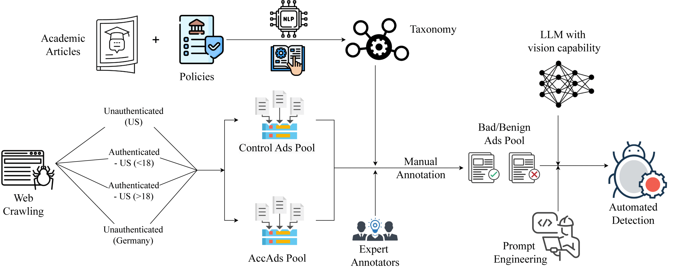

# [Sheep's clothing, wolfish impact](https://racro.github.io/papers/Accads_PETS.pdf)

This repository contains the code and analysis for our research on acceptable ads and their impact on user privacy and experience.

## Project Structure

- [`accads_crawler/`](accads_crawler/README.md): Contains the web crawler implementation for collecting ad data
- [`processing_scripts/`](processing_scripts/README.md): Scripts for generating LLM annotations and agreement scores
- [`image_hashing/`](image_hashing/README.md): Tools for remove duplicate and redundant images
- [`sample_data/`](sample_data/README.md): Sample data for testing and demonstration

## Visual Overview


*Figure 1: A high-level architecture illustrating the ad classification pipeline. In one half, taxonomy preparation is depicted, leveraging academic articles and exchange policies. In parallel, web crawling is used to collect ads from various scenarios, including unauthenticated users (US and Germany) and authenticated users (under-18 and over-18). Once the ad pool is established, expert annotators provide manual annotations, which are then used to train an LLM model to automate the annotation process.*


*Figure 2: Different problematic ads identified during the crawl, categorized into six main groups for labeling ad content. Categories include: 1a and 1b (Regulations), 2 (Inappropriate or Offensive Content), 3a and 3b (Deceptive Claims and Exaggerated Benefits), 4a and 4b (Dark Patterns and Manipulative Design), 5a and 5b (User Experience Disruption), and 6a and 6b (Political and Socially Sensitive Topics)*

## Getting Started

Please refer to the README files in each subdirectory for specific instructions on using the tools and scripts.

## Dataset access
The complete dataset is available [here](https://drive.google.com/drive/folders/17fEI8vLrsrVImDq9DCrqu6ssugRyRaQo?usp=sharing). 
It contains `merged_ground_truth.csv` that contains the ground truth annotations. Each folder contains approximately 150 ad images that were extracted in that particular configuration.

### Reference
```
@inproceedings {,
    author = {Ritik Roongta and Julia Jose and Hussam Habib and Rachel Greenstadt},
    journal = {Proceedings on Privacy Enhancing Technologies},
    title = {{[Sheep's clothing, wolfish impact: Automated detection and evaluation of problematic 'allowed' advertisements](https://racro.github.io/papers/Accads_PETS.pdf)}},
    url = {https://racro.github.io/papers/Accads_PETS.pdf},
    year = {2025}
}
```